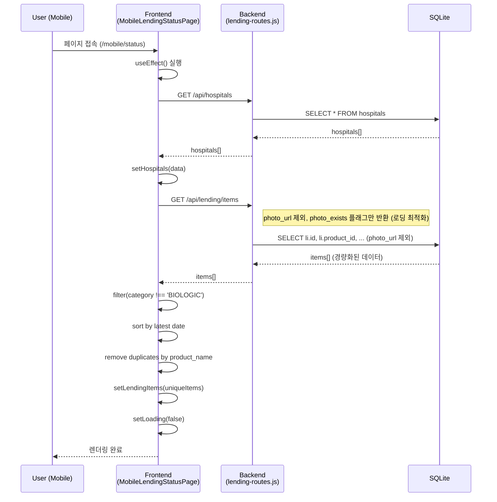
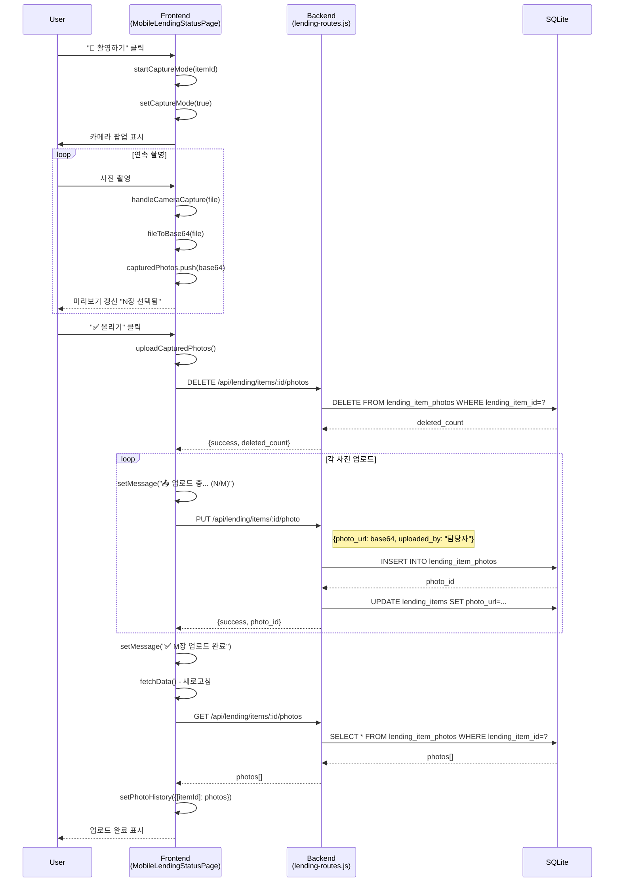
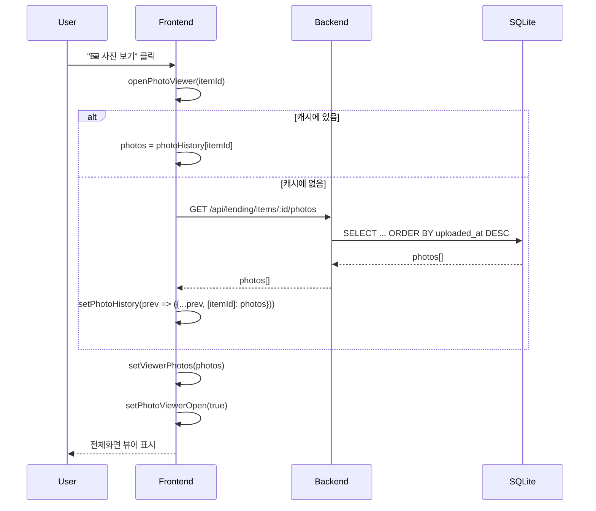

# 🏗️ 시스템 아키텍처 문서

## 📋 개요

의료기기 렌딩(대여) 관리 시스템의 기술 아키텍처 문서입니다.

---

## 🛠️ 기술 스택

| 계층 | 기술 |
|------|------|
| **Frontend** | React 18, CSS3 |
| **Backend** | Node.js, Express.js |
| **Database** | SQLite3 |
| **Barcode** | html5-qrcode, QuaggaJS |
| **Mobile** | 반응형 웹 (PWA 지원) |

---

## 📁 프로젝트 구조

```
medical-inventory-system/
├── server.js              # 백엔드 진입점
├── routes/
│   ├── hospital-routes.js # 병원 API
│   └── lending-routes.js  # 렌딩 API (사진 관리 포함)
├── database/
│   └── inventory.db       # SQLite 데이터베이스
├── client/
│   ├── public/
│   └── src/
│       ├── pages/
│       │   ├── mobile/    # 모바일 페이지
│       │   │   ├── MobileLendingPage.js
│       │   │   ├── MobileLendingStatusPage.js   # 장비기구배치현황
│       │   │   ├── MobileEquipmentStatusPage.js
│       │   │   └── ...
│       │   └── ...        # 데스크톱 페이지
│       ├── components/    # 공용 컴포넌트
│       └── styles/        # CSS 스타일
└── docs/
    └── ARCHITECTURE.md    # 본 문서
```

---

## 🗄️ 데이터베이스 스키마

### products (제품)
```sql
CREATE TABLE products (
    id INTEGER PRIMARY KEY,
    barcode TEXT UNIQUE,       -- 바코드 (IMG로 시작하면 이미지 등록)
    name TEXT,
    category TEXT,             -- EQUIPMENT, BIOLOGIC, CONSUMABLE
    current_stock INTEGER,
    safety_stock INTEGER,
    unit_price REAL,
    notes TEXT,
    repair_history TEXT,
    created_at DATETIME,
    updated_at DATETIME
);
```

### hospitals (병원)
```sql
CREATE TABLE hospitals (
    id INTEGER PRIMARY KEY,
    name TEXT,
    code TEXT UNIQUE,
    address TEXT,
    contact_person TEXT,
    phone TEXT
);
```

### lending_items (렌딩 아이템)
```sql
CREATE TABLE lending_items (
    id INTEGER PRIMARY KEY,
    product_id INTEGER,
    hospital_id INTEGER,
    channel_id INTEGER,
    serial_number TEXT,
    quantity INTEGER,
    expiration_date DATE,
    deploy_date DATETIME,
    return_date DATETIME,
    status TEXT,               -- ACTIVE, RETURNED
    photo_url TEXT,            -- 최신 사진 (호환성용)
    photo_uploaded_by TEXT,
    photo_uploaded_at DATETIME,
    notes TEXT,
    purchase_price REAL,
    selling_price REAL
);
```

### lending_item_photos (사진 이력) ⭐ NEW
```sql
CREATE TABLE lending_item_photos (
    id INTEGER PRIMARY KEY,
    lending_item_id INTEGER,   -- FK → lending_items.id
    photo_url TEXT,            -- Base64 인코딩 이미지
    uploaded_by TEXT,          -- 업로더 이름
    uploaded_at DATETIME DEFAULT CURRENT_TIMESTAMP
);
```

### lending_movements (이동 이력)
```sql
CREATE TABLE lending_movements (
    id INTEGER PRIMARY KEY,
    lending_item_id INTEGER,
    from_hospital_id INTEGER,
    to_hospital_id INTEGER,
    movement_type TEXT,        -- DEPLOY, MOVE, RETURN
    quantity INTEGER,
    moved_by TEXT,
    photo_url TEXT,
    notes TEXT,
    movement_date DATETIME
);
```

---

## 🔌 API 엔드포인트

### 렌딩 API (`/api/lending`)

| Method | Endpoint | 설명 | 요청 Body | 응답 |
|--------|----------|------|----------|------|
| GET | `/items` | 전체 렌딩 현황 | `?category=EQUIPMENT&hospital_id=1` | `[{item}]` |
| GET | `/items/barcode/:barcode` | 바코드로 제품 조회 | - | `{product, lending}` |
| POST | `/deploy` | 신규 배치 | `{product_id, hospital_id, ...}` | `{success, lending_item_id}` |
| POST | `/move` | 병원 간 이동 | `{lending_item_id, to_hospital_id}` | `{success}` |
| POST | `/return` | 회수 | `{lending_item_id}` | `{success}` |
| DELETE | `/items/:id` | 아이템 삭제 | - | `{success}` |

### 사진 API (`/api/lending/items/:id/photo*`) ⭐ UPDATED

| Method | Endpoint | 설명 | 요청 Body | 응답 |
|--------|----------|------|----------|------|
| PUT | `/items/:id/photo` | 사진 업로드 (무제한) | `{photo_url, uploaded_by}` | `{success, photo_id}` |
| GET | `/items/:id/photos` | 사진 이력 조회 | - | `[{id, photo_url, uploaded_by, uploaded_at}]` |
| DELETE | `/items/:id/photos` | 전체 사진 삭제 | - | `{success, deleted_count}` |
| DELETE | `/items/:id/photos/:photoId` | 개별 사진 삭제 | - | `{success}` |

### 병원 API (`/api/hospitals`)

| Method | Endpoint | 설명 |
|--------|----------|------|
| GET | `/` | 전체 병원 목록 |
| GET | `/:id` | 병원 상세 |
| POST | `/` | 병원 등록 |
| PUT | `/:id` | 병원 수정 |

---

## 📊 시퀀스 다이어그램

### 1. 장비 현황 페이지 로딩



### 2. 연속 촬영 및 업로드 플로우



### 3. 사진 보기 플로우



---

## 📱 모바일 기능

### 신규 배치
- **QR 스캔 배치**: 바코드 스캔으로 제품 등록
- **이미지 배치**: 사진으로 제품 등록 (IMG 바코드 생성)

### 이동/회수
- **QR 스캔**: 바코드 스캔으로 제품 확인
- **제품 선택**: 이미지 등록 제품 목록에서 선택

### 배치 현황 (MobileLendingStatusPage)
- 제품별 상태 표시 (정상, 만료 임박)
- **사진 업로드/보기 (무제한)** ⭐ 변경됨
- **연속 촬영 모드** (촬영 → 미리보기 → 일괄 업로드)
- 비고/수리 내용 팝업
- 편집/삭제 기능

---

## 🔧 주요 함수 시그니처

### Frontend (MobileLendingStatusPage.js)

```javascript
// API 호출
const fetchData = async () => {
    const hospitalsRes = await axios.get('/api/hospitals');
    const itemsRes = await axios.get('/api/lending/items', { params });
    // 필터링 & 정렬 & 중복제거
    setLendingItems(uniqueItems);
    setLoading(false);
};

// 사진 업로드
const uploadCapturedPhotos = async () => {
    await axios.delete(`/api/lending/items/${captureItemId}/photos`);
    for (let i = 0; i < totalPhotos; i++) {
        await axios.put(`/api/lending/items/${captureItemId}/photo`, {
            photo_url: capturedPhotos[i],  // string (Base64)
            uploaded_by: uploaderName       // string
        });
    }
};

// 사진 보기
const openPhotoViewer = async (itemId, item, e) => {
    const res = await axios.get(`/api/lending/items/${itemId}/photos`);
    // 응답: [{id, photo_url, uploaded_by, uploaded_at}]
    setViewerPhotos(res.data);
};
```

### Backend (lending-routes.js)

```javascript
// PUT /items/:id/photo
router.put('/items/:id/photo', (req, res) => {
    const { id } = req.params;
    const { photo_url, uploaded_by } = req.body;
    // INSERT INTO lending_item_photos
    // UPDATE lending_items
    res.json({ success: true, photo_id: newPhotoId });
});

// GET /items/:id/photos
router.get('/items/:id/photos', (req, res) => {
    db.all(`SELECT id, photo_url, uploaded_by, uploaded_at
            FROM lending_item_photos
            WHERE lending_item_id = ?
            ORDER BY uploaded_at DESC`, [id], ...);
    // ⚠️ 현재 LIMIT 제거 필요!
});

// DELETE /items/:id/photos
router.delete('/items/:id/photos', (req, res) => {
    db.run(`DELETE FROM lending_item_photos WHERE lending_item_id = ?`, [id], ...);
    res.json({ success: true, deleted_count: this.changes });
});
```

---

## 🚨 현재 이슈 (2025-12-23)

### ⚠️ 장비기구배치현황 페이지 로딩 실패

**증상**: 페이지 접속 시 "로딩 중..." 상태에서 멈춤

**원인 추정**:
1. 프론트엔드에서 API 호출 실패 시 에러 핸들링 부족
2. `fetchData()` 내부에서 예외 발생 시 `setLoading(false)` 미실행

**확인 필요**:
1. 브라우저 개발자 도구 → Console 에러 확인
2. Network 탭 → API 응답 상태 확인
3. `fetchData()` 함수 내부 디버그 로그 추가

---

## 📅 변경 이력

| 날짜 | 버전 | 변경 내용 |
|------|------|----------|
| 2024-12-16 | 1.5.0 | 초기 아키텍처 문서 작성 |
| 2025-12-22 | 1.6.0 | 사진 10장 제한 제거, 연속 촬영 모드 추가 |
| 2025-12-23 | 1.6.1 | 시퀀스 다이어그램 추가, API 시그니처 상세화 |
